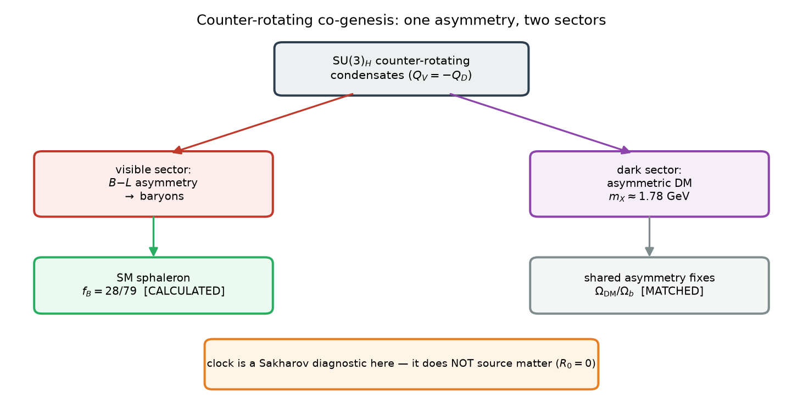
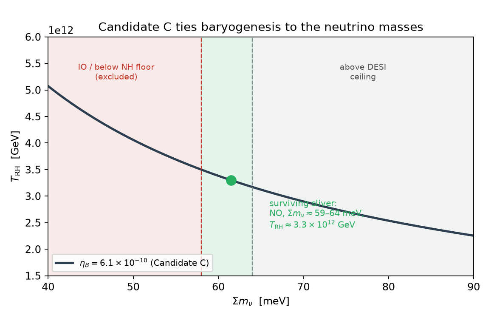

# Entropy-Clock Counter-rotating Co-genesis: Baryons and ~1.78 GeV Asymmetric Dark Matter from Pre-inflationary Initial Conditions

**Stilian Pandev** ([ORCID: 0009-0005-8153-071X](https://orcid.org/0009-0005-8153-071X))

*Paper VII of the Unified Structural-Entropy Cosmogenesis (USC) program — the DAWN face (matter genesis).*

---

## Abstract

We present a mechanism in which the baryon asymmetry and dark matter share a single origin fixed by
*pre-inflationary initial conditions* rather than thermal freeze-out. Two counter-rotating hidden condensates
carry a $\mathrm{U}(1)_{\mathcal{Q}}$ charge with equal and opposite sign — we postulate $Q_V = -Q_D$ — so that the
comoving *difference* charge $a^{3}(n_V - n_D)$ is exactly conserved and the visible and dark sectors leave a
first-order, CP-odd transition at a nucleation temperature $T_n \approx 3.2\times10^{12}$ GeV with
equal-and-opposite chemical potentials. This *counter-rotating co-genesis* (ECCG) sits in the Affleck–Dine /
asymmetric-dark-matter (ADM) class [@Kaplan:2009ag; @Petraki:2013wwa; @Zurek:2013wia; @Cheung:2011if] with a
darkogenesis-style first-order impulse [@Shelton:2010ta; @Hall:2019rld] — not a new mechanism *class* — but the
architecture is specific and makes a sharp, falsifiable commitment: **dark matter is *asymmetric* and light,
$m_X \approx 1.78$ GeV**, a GeV-scale direct-detection and collider target, so the model is excluded if dark
matter is established as symmetric/thermal or far from the GeV window. Throughout, we are explicit about which
statements are calculated here, which are fixed by matching data, and which are postulated, assumed,
constructed, or preliminary. Standard-Model sphaleron reprocessing transfers a fixed fraction $f_B = 28/79$
[@Harvey:1990qw] of the $B{-}L$ asymmetry into baryons; we show this textbook value carries over to ECCG
because the dark sector is Standard-Model-singlet and chemically decoupled at the electroweak scale
($\Gamma_{\rm mix}/H = 7.5\times10^{-4}$), making $f_B = 28/79$ the one genuinely calculated closure of the
mechanism — argued (not re-derived operator-by-operator) to carry over unmodified. The shared asymmetry then
fixes $m_X = (\Omega_X/\Omega_b)\, m_p\,(28/79) \approx 1.78$ GeV by matching the observed
$\Omega_{\rm DM}/\Omega_b$ (matched, not predicted independently).
A distinct realization — "Candidate C" — ties $\eta_B \propto T_{\rm RH}^{2}\,(\Sigma m_\nu)^{2}$ to neutrino masses; hybridized with
ECCG's reheating window it squeezes to **normal ordering, $\Sigma m_\nu \approx 59\text{–}64$ meV, and
$T_{\rm RH} \approx 3.3\times10^{12}$ GeV** [@Elbers:2025vlz]. We are explicit that this range *brushes the
normal-ordering floor* ($\Sigma m_\nu \gtrsim 58$ meV): it is a **consistency constraint, not a discriminating
prediction** — its confirmation would not single out ECCG, and its inverted-ordering falsification is
DESI's own conclusion, independent of this model. It survives in only ~1% of prior impulse-volume, so it
constrains the mechanism without testing it against the null. The magnitude
of $\eta_B$ is irreducibly a fit; the microscopic strong-coupling inputs (the first-order transition, the
confining vacuum, the wall velocity) are validated pipelines producing preliminary numbers, not confirmed
results. We say so throughout, and list the falsifiers.

**Keywords —** baryogenesis; asymmetric dark matter; co-genesis; first-order phase transition; hidden sector; CP violation

---

## 1. Introduction

Two of cosmology's stubborn number problems are the baryon asymmetry $\eta_B \equiv n_B/n_\gamma = 6.1\times10^{-10}$ and the
dark-matter density $\Omega_{\rm DM} h^{2} \approx 0.12$, with the further nagging fact that $\Omega_{\rm DM}/\Omega_b \approx 5$ is an *order-unity*
ratio rather than the many-decade gap one would naively expect from unrelated sectors [@Boucenna:2013wba; @Davoudiasl:2012uw]. Asymmetric dark matter
(ADM) frameworks [@Kaplan:2009ag; @Petraki:2013wwa; @Zurek:2013wia] explain the coincidence by sourcing both sectors from one asymmetry; the price is usually a
new mechanism to communicate it. This paper is the matter-genesis face of a larger program — the Unified
Structural-Entropy Cosmogenesis (USC) — which posits a single horizon-entropy "clock"
$\mathcal{D}_E = (3/2)(1-w)$ joining three physical faces: **dusk** (dark energy without Λ; [Paper III / SEDE cosmology, Zenodo 10.5281/zenodo.21651614]), **dawn** (this paper), and **galactic** (a MOND readout; Paper VIII / APDM galactic, Zenodo 10.5281/zenodo.21652176). The scale sector [Paper VI / scale sector, Zenodo 10.5281/zenodo.21652167] sets the mass scales that this
paper's dark-matter horns draw on. The full unification is formalized in the umbrella paper [Paper V / USC
framework], and every paper cites the frozen pre-registration falsifier matrix (Zenodo
`10.5281/zenodo.21415326`).

For the reader who has not seen those companions: **this paper is self-contained.** The mechanism of §2,
the sphaleron transfer of §3, and the central result — the asymmetric dark-matter mass
$m_X = 1.782\,f_{\rm sph}(T_{\rm dec}) \approx 1.78$ GeV, fixed by sphaleron timing rather than by
washout — are derived here from the stated hidden-sector content and take no numerical input from any
companion. The program references above place the construction in its wider setting; the scale-sector
paper additionally supplies an *optional* alternative horn (a glueball subcomponent, §7), which is one
branch among those enumerated and not a premise of the main line. Nothing in §§2–5 depends on it. All
companions are available as open preprints at the DOIs cited, so every reference here resolves to a
readable manuscript.

The dawn mechanism, ECCG (Entropy-Clock Counter-rotating Co-Genesis), works as follows. A hidden gauge sector
$\mathrm{SU}(3)_H$ supports two condensates carrying opposite $\mathrm{U}(1)_{\mathcal{Q}}$ charges ($Q_V = -Q_D$). A first-order transition
in the early universe gives these condensates a CP-odd impulse; the equal-and-opposite charge structure means
the visible and dark sectors leave the transition with equal-and-opposite chemical potentials. The
Standard-Model electroweak sphaleron then converts a calculable fraction of the resulting $B{-}L$ into baryon
number, and the leftover dark charge freezes out as asymmetric dark matter whose *mass is fixed by the shared
asymmetry* — the ADM co-genesis logic in its cleanest form [@March-Russell:2011ang; @Cheung:2013dca]. The
counter-rotating condensate architecture — a charge carried with equal-and-opposite sign in the visible and
dark sectors, so that a comoving asymmetry is conserved and the two sectors inherit opposite chemical
potentials — is closest in spirit to Affleck-Dine cogenesis [@Cheung:2011if]; the hidden first-order-transition
route from which the impulse is sourced parallels darkogenesis [@Shelton:2010ta] and asymmetric matter from a
dark first-order phase transition [@Hall:2019rld].

We are deliberately austere about what this buys. ECCG is best described as a **matched-EFT existence proof**
of GeV-scale asymmetric co-genesis with one sharp handle ($m_X \approx 1.78$ GeV), not a fully predictive theory: the
*sign* of the asymmetry is environmental, the *magnitude* of $\eta_B$ is a fit, and the microscopic strong-coupling
inputs are benchmark-grade. The value of the construction is (i) the single genuinely-calculated closure
($f_B = 28/79$), (ii) the near-floor neutrino *consistency constraint* of the Candidate-C variant, and
(iii) the way the dawn face over-determines itself against the rest of the program through the shared clock and
the identity $\omega_b \equiv \eta_B$.

### 1.1 The connection to the entropy clock — and an important negative result

The wider program is organized around an entropy clock $\Theta_E = \ln(3H/4Gs)$, $\mathcal{D}_E = (3/2)(1-w)$, which reads
$\mathcal{D}_E \approx 1$ at the dawn (radiation-like) and $\mathcal{D}_E \to 3$ at the dusk (de Sitter-like). It is tempting — and the
early ECCG development attempted this — to have the clock *directly source* the matter asymmetry through a
spontaneous-baryogenesis chemical potential $\mu_Q/T \propto H/T$. **That direct-source mechanism is dead**
(a calculated, proven negative): the arrow operator that would source it is $\mathbb{Z}_2$-even, so its coefficient
$R_0 = 0$ by symmetry, and independent yield estimates fall short by many orders of magnitude. We state this
plainly because it is load-bearing for the program's honesty: *the clock does not source matter.* ECCG is a
**pre-inflationary initial-condition theory** — the asymmetry is laid down by the condensate impulse at a
first-order transition, not pumped by the clock — and the clock's role in the dawn is confined to the
timing/thermodynamic backdrop and the over-determination bookkeeping. The $R_0 = 0$ no-go is what forced the
program to this honest, narrower position.

---

## 2. The mechanism

Figure 1 sets out the mechanism schematically; the rest of this section derives each step.

**Figure 1.** Counter-rotating co-genesis. SU(3)$_H$ counter-rotating condensates ($Q_V=-Q_D$) seed a $B{-}L$ asymmetry that the SM sphaleron transfers to baryons with the calculated fraction $f_B=28/79$, and a shared asymmetry in the dark sector fixing an asymmetric dark-matter density ($m_X\approx1.78$ GeV, $\Omega_{\rm DM}/\Omega_b$ matched). The entropy clock is a Sakharov diagnostic here — by the $R_0=0$ theorem it does not itself source matter.

### 2.1 Counter-rotating condensates and the conserved comoving asymmetry

The field content of the ECCG benchmark comprises a hidden $\mathrm{SU}(3)_H$ gauge sector, a $\mathbb{Z}_{31}$ flavor structure, a
$\mathrm{U}(1)_{\mathcal{Q}}$ under which two scalar condensates $\Phi_V, \Phi_D$ carry **equal and opposite charge** $Q_V = -Q_D$,
which we postulate as the defining structural assumption of the model. The immediate consequence is a
conservation law,

> $d/dt\,[\,a^{3}\,(n_V - n_D)\,] = 0$,   i.e. $Q_V = -Q_D \Rightarrow$ a conserved comoving *difference* charge
> (calculated, given the charge assignment).

Two independent ECCG codebases converge on this equal-and-opposite structure, the transfer ratio $R_{\rm tr}$, and
$m_X$ (`CROSS_CHECK_MEMO.md`: "AGREE"; $m_X = 1.33$ vs $1.3255$ GeV in the older flavored normalization). The
counter-rotating structure is what makes this a *co-genesis*: the same impulse that populates the visible
$B{-}L$ populates the dark charge, with a fixed relative sign, so the two abundances are locked together. This
conserved counter-rotating charge structure — equal-and-opposite $Q_V = -Q_D$ with a conserved comoving
difference $a^{3}(n_V - n_D)$ and equal-and-opposite chemical potentials — is the closest prior art to Affleck-Dine
cogenesis [@Cheung:2011if].

### 2.2 The CP-odd impulse and the first-order transition

The asymmetry requires (Sakharov) a departure from equilibrium and CP violation [@Morrissey:2012db]. The departure from equilibrium
is a first-order transition; the CP violation enters through the phase of the condensate potential,

> $V_2 = -\Lambda_2^{4} \cos(2\psi + \delta_2)$,   with $\delta_2 = n_2\,\theta_S$, $\delta_3 = n_3\,\theta_S$,

so that the CP-odd combination $\Delta_{\rm CP} = (3n_2 - 2n_3)\,\theta_S \equiv m\cdot\theta_S$ is set by the **flavon** phase $\theta_S$ at scale
$v_S$, not by the hidden sector. Spontaneous CP violation in the minimal $\mathbb{Z}_2$ flavon model makes $\Delta_{\rm CP}$
calculable and generically O(1), peaked at $\pi/2$ (calculated as a distribution, not a single number): the scan
gives median $|\Delta_{\rm CP}| = 1.572$ rad, 16–84% $[1.070, 2.067]$, $\sin(\Delta_{\rm CP}/2)$ median $0.708$ (`SPONTANEOUS_CP_REPORT`).
The symmetric-point value $\Delta_{\rm CP} = \pi/2$ is exact but **not radiatively stable** ($\lambda'' \sim \lambda\lambda'/16\pi^{2}$ is
regenerated), so $\pi/2$ is a central value, not a protected prediction — we quote it as such. Two structural
no-go theorems constrain the flavon: a single $\mathrm{U}(1)_{\mathcal{Q}}$-commensurate flavon gives $\Delta_{\rm CP} = 0$ identically, and a
single $\mathbb{Z}_N$-invariant harmonic gives only geometric CP-conserving phases $\in \{0, \pi\}$ (calculated and verified
numerically).

### 2.3 The pre-inflationary domain cure and its reheating threshold (D-1)

A spontaneous-CP mechanism generically produces domains of opposite sign that would wash the net asymmetry to
$\eta \approx 0$. ECCG cures this by inflating the flavon phase to uniformity — the domain-selecting quantity is which
$\mathbb{Z}_2$ minimum $\psi$ occupies, fixed by $\delta_2 = n_2\theta_S$, and an inflated flavon phase is uniform. This cure survives
reheating (calculated, D-1). The worry (critique gap G-M1) was that if $T_{\rm RH}$ exceeds the hidden confinement
scale $\Lambda_H = 6.35\times10^{12}$ GeV, $\mathrm{SU}(3)_H$ deconfines, $\Lambda_2^{4}$ melts, $\psi$ is released, and reconfinement
Kibble-regenerates the domains. It does not fire, for three model-grounded reasons:

1. **The sign lives in the flavon-set phase, not the hidden sector.** The domain-selecting phase is $\delta_2 = n_2\theta_S$,
   set at $v_S$, and the model already requires $T_{\rm RH} < v_S$; an inflated flavon phase is uniform.
2. **$\mathrm{SU}(3)_H$ reconfines *real*, adding no phase.** The quantum-modified moduli constraint with positive soft
   masses selects $\arg\langle\Theta\rangle = 0$, so a melt/reform of the *magnitude* $\Lambda_2$ re-pins $\psi$ with the same uniform
   phase structure.
3. **The released phase cannot random-walk into domains.** Even at the top of the window, the hidden sector is
   deconfined for only ~0.35 e-folds, and the released $\psi$ fluctuates by $\delta\psi \sim H/(2\pi f_\psi) \approx 2.6\times10^{-6}$ rad — six
   orders below the $\pi/2$ ridge between vacua ($\delta\psi/(\pi/2) = 1.6\times10^{-6}$). No flips.

The corrected reheating threshold is therefore **$T_{\rm RH} < v_S$, not $T_{\rm RH} < \Lambda_H$** (calculated, D-1). The
economical single-flavon option (branch B) sits at $v_S = 2.44\times10^{13}$ GeV, giving a tight-but-open window
$T_{\rm RH} \in [3.2\times10^{12}, 2.4\times10^{13}]$ GeV (factor 7.7); branch A ($v_S = 4.79\times10^{15}$ GeV) is comfortable (factor ~1500)
but needs a second gauged flavon to protect strong CP (§8, §9). G-M1 is thereby downgraded from CRITICAL to a
satisfied consistency condition — and the cure is not free: it surfaces an independent neutron-EDM falsifier
(§9, branch B).

---

## 3. The sphaleron transfer $f_B = 28/79$ — the one calculated closure

Once a $B{-}L$ asymmetry exists above the electroweak scale, Standard-Model sphalerons reprocess it into a baryon
asymmetry with a fixed conversion factor [@Khlebnikov:1988sr]. For the Standard Model with $N_g = 3$ generations and $N_H = 1$ Higgs
doublet, the Harvey–Turner equilibrium result [@Harvey:1990qw] is

> $f_B = (8 N_g + 4 N_H) / (22 N_g + 13 N_H) = 28/79 \approx 0.354$   (a standard textbook Standard-Model result).

The non-trivial ECCG claim is that this *textbook* value carries over unmodified to a theory with an extended
dark sector. It does, for two reasons, both computed:

1. **The dark sector is SM-gauge-singlet.** The condensates and $X$ carry no $\mathrm{SU}(2)_L$ isospin, so they are
   *sphaleron-inert* — the sphaleron acts only on the visible chiral content, and the counting is the pure SM
   counting.
2. **The dark sector is chemically decoupled at the electroweak scale.** The portal mixing rate is
   $\Gamma_{\rm mix}/H = \epsilon^{2} \alpha T / H = 7.5\times10^{-4} \ll 1$ at $T \approx 130$ GeV (for portal coupling $\epsilon = 4.2\times10^{-9}$). So no dark
   charge leaks back through the sphaleron bath during reprocessing; the visible-baryon factor is the pure SM
   value.

This is the **one genuinely calculated closure** of the mechanism: an item that moved from "assumed" to
"calculated" in the audit (`reports/CLOSURES_assumed_vs_calculated.md`, N4). We flag the honest caveat carried in the
corpus: a *strong-portal* or $\mathrm{SU}(2)_L$-charged variant would require recomputation, and the full recomputation
of $f_B$ with ECCG's added chiral content at the sphaleron scale has not been done from scratch — it is argued
to reduce to the SM value by singlet-ness and decoupling, not re-derived operator-by-operator
(`reports/AUDIT_assumed_vs_calculated.md`). Within the benchmark this is safe. We do not inflate it into "the dawn is
calculated"; it is one closure, and we present it as the exception, not the rule.

---

## 4. The dark-matter mass and the co-genesis relation

Figure 2 summarises the resulting squeeze on Candidate C, which this section derives.

**Figure 2.** The Candidate-C squeeze. With $\eta_B\propto T_{\rm RH}^2(\Sigma m_\nu)^2$ fixed to the observed $6.1\times10^{-10}$, the normal-ordering floor and the DESI ceiling bracket a thin surviving region: normal ordering, $\Sigma m_\nu\approx59$–$64$ meV, $T_{\rm RH}\approx3.3\times10^{12}$ GeV. Inverted ordering is excluded; a DESI tightening below the NH floor kills the variant.

Given the shared asymmetry and the sphaleron transfer, the dark-matter mass is fixed by requiring the *same*
asymmetry to yield the observed $\Omega_{\rm DM}/\Omega_b$:

> $m_X = (\Omega_X/\Omega_b) \cdot m_p \cdot (28/79) / r_{X,BL} \approx 1.78$ GeV   at $r_{X,BL} = 1$   (matched to $\Omega_{\rm DM}/\Omega_b = 5.36$, not predicted) [@Kaplan:2009ag].

This is *matched*, not predicted: $\Omega_{\rm DM}/\Omega_b = 5.36$ is adopted from observation and inverted for the mass. The
flavored-charge ratio $r_{X,BL}$ is a genuine model uncertainty — $r_{X,BL} = 1$ gives 1.78 GeV, while the
older flavored correction gave ~1.3 GeV (`reports/CONVENTIONS_AND_CORRECTIONS.md`). We adopt $m_X \approx 1.78$ GeV as the
benchmark, with the honest note that an earlier momentum-resolved-transport calculation finds $m_X$ set by
*sphaleron timing* (not washout), $m_X = 1.782 \cdot f_{\rm sph}(T_{\rm dec})$, landing at 1.78 GeV in ~89% of its viable
window (`reports/CONSOLIDATED_THEORY.md`) — a preliminary narrowing (single volume/one-loop, not yet converged) that
supports, but does not replace, the matched normalization.

The dark matter is cold, asymmetric, and phenomenologically near-invisible: $\sigma_{\rm SI} \sim 2\times10^{-48}$ cm$^{2}$, below the
neutrino fog. Its most distinctive external signature is *the absence of signatures* — no direct detection, and
(in horn (i)) $r \approx 0$ in primordial tensors.

We treat the dark-matter identity as a **three-horn** structure and present all three honestly:

**Horn (i) — pure ADM (ECCG-res-iv).** The condensate impulse sources both sectors; $\Omega_{\rm DM}/\Omega_b \approx 5$ is
*explained* by the shared asymmetry, and $m_X = 1.78$ GeV is sharp. $\eta_B$ is a fit (§5.4). Tensors: $r \leq 2\times10^{-11}$.
This is the horn in which co-genesis does its signature work — the $\Omega_{\rm DM}/\Omega_b$ coincidence is a consequence, not
an input. Its cost is that $\eta_B$'s magnitude is not derived.

**Horn (ii) — Candidate-C hybrid.** The clock+Weinberg channel makes $\eta_B$ calculable (§5) at the cost of
discarding the condensate, so $m_X$ becomes a band (0.18–840 GeV) rather than a sharp value, and the
$\Omega_{\rm DM}/\Omega_b$ coincidence is one equation in two unknowns. This is the horn that ties $\eta_B$ to the neutrino sector — a near-floor consistency constraint, not a discriminating prediction (§5).

**Horn (iii) — glueball one-sector.** The same hidden confining sector that generates the μ scale [Paper VI /
scale sector] supplies $\Omega_{\rm DM}$ via 3→2 (SIMP/cannibal) glueball freeze-out, with a *predicted* mass
$m_G = 6\Lambda_h = 180\text{–}630$ MeV (calculated across the two-loop $\Lambda_h = 28\text{–}105$ MeV band). Honest ledger entry
(`reports/GLUEBALL_DM_assessment.md`): the SIMP "miracle" here is a **mass** miracle ($m_G$ lands where 3→2 works with a
natural coupling $\alpha_{\rm eff} \approx 0.25\text{–}0.6$), **not an abundance miracle**. Pure glue has no renormalizable portal, so
the abundance is set by the hidden-to-visible temperature ratio $\xi$, and requires an inflaton branching
$\mathrm{Br} \approx (0.4\text{–}3)\times10^{-10}$ selected to ~40% — a dial that *replaces* ADM's explained $\Omega_{\rm DM}/\Omega_b$. This horn uniquely
evades the single-source theorem (§10.1) because glueball DM is *thermally* sourced, not clock-sourced, so it
achieves both a derived $\eta_B$ (via Candidate C) and a predicted $m_G$ — at the stated cost of the $\mathrm{Br}$ dial. Its
distinctive signature is velocity-*independent* self-interaction $\sigma/m \approx 0.01\text{–}0.47$ cm$^{2}$/g, already at the
cluster-constraint boundary for $\Lambda_h \approx 30$ MeV.

**The environmental sign bit.** In all horns the *magnitude* $|\eta_B|$ is predicted but the *sign* is environmental:
spontaneous CP violation chooses between $\pm\theta_S^{*}$ (exactly degenerate CP partners), and inflation makes that
choice uniform across the observable universe. So the theory predicts that we live in a matter-dominated (not
antimatter-dominated) universe with the observed magnitude, but does not predict *which* — a standard feature of
spontaneous-CPV baryogenesis, stated for honesty.

---

## 5. Candidate C and neutrinos (D-2)

### 5.1 The channel

Candidate C is the clock-driven variant in which baryogenesis proceeds through the Weinberg operator (whose
coefficient *is* the neutrino mass) [@Davidson:2008bu], giving

> $\eta_B \propto T_{\rm RH}^{2} \cdot (\Sigma m_i^{2})$,   more precisely $\eta_B \propto T_{\rm RH}^{2}\, \Sigma m_\nu^{2} / 2\pi$   (calculated within the matched EFT).

The washout mass is $\bar{m}^{2} = \Sigma m_i^{2}$ (sum of *squares*), while cosmology bounds $\Sigma m_i$ (sum) — different
observables. D-2 maps between them via the lightest-mass parametrization for NO and IO, using a real ΔL=2
washout Boltzmann rather than the weak-washout analytic (which overshoots 13–31% in-window). The calibration:
$Y_B(3.17\times10^{12}, \text{NO-floor}) = 7.98\times10^{-11}$, matching the shipped script.

### 5.2 The squeeze

Setting $\eta_B = 6.10\times10^{-10}$ fixes the line $\eta_B \propto T_{\rm RH}^{2}\, \Sigma m_i^{2}$. Intersecting it with the neutrino mass floors,
the DESI ceiling, and ECCG's reheating window gives a **razor-thin allowed region** (calculated, D-2):

> **$T_{\rm RH} \approx 3.28\text{–}3.31\times10^{12}$ GeV, $\Sigma m_\nu \approx 59\text{–}64$ meV, NORMAL ORDERING** (width in $T_{\rm RH}$: factor 1.01).

The NO mass floor (58.6 meV) is matched at $T_{\rm RH} = 3.31\times10^{12}$ GeV; the DESI DR2 baseline ceiling (64 meV) [@Elbers:2025vlz] is hit
at $T_{\rm RH} = 3.28\times10^{12}$ GeV. The band is $\leq 6$ meV wide and sits exactly at the current DESI cut. The rest of the
reheating window ($T_{\rm RH} \gtrsim 3.6\times10^{12}$ GeV) needs $\Sigma m_i^{2} <$ the NO floor — impossible for any real neutrino
spectrum — so it *overproduces* $\eta_B$. This is why D-1's widening of the upper window edge (from $\Lambda_H$ to the
portal-thermal $9\times10^{12}$ GeV) does not change the result: the extra room is all overproducing space; the viable
sliver at $T_{\rm RH} \approx 3.3\times10^{12}$ GeV stands.

### 5.3 The two sharp falsifiers, and the ~1% survival

- **Inverted ordering is excluded.** The IO floor ($\Sigma m_\nu = 99$ meV) requires $T_{\rm RH} = 2.4\times10^{12}$ GeV (below the
  reheating window) and lies far above the DESI ceiling [@Elbers:2025vlz; @Hannestad:2016fog]. A confirmed IO kills Candidate C.
- **DESI's aggressive bound is already below the NO floor.** The DESI DR2 + DESY5 combination gives
  $\Sigma m_\nu < 46$ meV [@Elbers:2025vlz], *below* the 58.6 meV oscillation floor — the emerging "neutrino mass anomaly." If it holds,
  the Weinberg operator loses its anchor and Candidate C is falsified together with the mass floor itself.

Honestly, this is a **squeeze, not a parameter-free prediction**. The O(1)-coupling systematic ($g_\chi$, the
Weinberg normalization $C_W$, $g_*$) is ≈ ×13 in $T_{\rm RH}$; the robustness scan finds that *almost every point in
that space is already in tension* (raising $g_\chi$ overproduces $\eta_B$; lowering $C_W$ needs DESI-excluded 100–250
meV neutrinos). Only the canonical point threads the window and a DESI-allowed NO mass — roughly ~1% of prior
volume survives. The robust statement is therefore *not* "C predicts $\Sigma m_\nu = 60$ meV" but "C's viable region is
squeezed to NO + $\Sigma m_\nu$ at its floor + $T_{\rm RH}$ at the bottom of the window, exactly where DESI is cutting." The
DESI numbers quoted (baseline 64 meV, aggressive 46 meV) [@Elbers:2025vlz] are representative as of early 2026 and should be
refreshed against the live posterior before quoting; the *structure* (floor-vs-ceiling squeeze) is robust to
the exact ceiling.

### 5.4 $\eta_B$ is matched, not four-times-derived

We are explicit about a meta-pattern the audit flagged (P3). The ECCG corpus contains four "independent
confirmations" of $\eta_B$ — from $\Delta_{\rm CP}$, $m_3/H$, $\eta_2$, and $v_w$ — but each of these is computed through a
**common calibrated `src/predict_eta_B.py`** that already encodes the $\eta_B$ fit; each report tunes its own knob
($\eta_3 = 1$, $m_3/H$ solved, bracket $= 1$, $T_*$ free) to reproduce the same $\eta_B \approx 6\times10^{-10}$. So "four
confirmations landing on $\eta_B$" is largely **one fit viewed four ways**. The magnitude of $\eta_B$ (equivalently
$m_3/H$) is irreducibly a fit: an attempt to derive it from maximum-entropy production overshoots by ~10⁹
(`reports/USC_m3_derivation.md`). In fairness, the natural (untuned) forward value is not absurd — the spontaneous-CP
scan puts the *median* $\eta_B = 1.21\times10^{-9}$ (16–84% $[0.87, 1.47]\times10^{-9}$), within a factor $\simeq 2$
of the observed $6.1\times10^{-10}$. We state the position of the observed value precisely, because a factor of two
is not the same as agreement: recomputing directly from the 40,000-draw scan
(`src/spontaneous_cp.py`, `data/spontaneous_cp_scan.csv`), the observed $\eta_B$ sits at the **6.6th percentile**
of the natural distribution — below the 16th percentile, i.e. in the lower tail rather than the bulk. So the
honest statement is bounded on both sides: the model's untuned prediction is the right order of magnitude and
is *not* fine-tuned to O(1), but it systematically **overshoots** the observed asymmetry by $\simeq 2$, and only
$\sim 7\%$ of the natural parameter space lands at or below the measured value. That residual factor is
unexplained: it is the size of a dilution or transfer factor, and identifying its origin — or establishing that
none exists — is the sharpest open question in this sector. It is *not* a derivation of the magnitude, and
$m_3/H$ is still solved to hit $\eta_B$. We therefore present $\eta_B = 6.1\times10^{-10}$ as **matched, not predicted** (with the rider that the natural
value is within ~×2), and the dawn cross-checks as *one consistency, not four predictions*. What is *not* a fit is the neutrino squeeze of §5.2, which follows once
the fitted $\eta_B$ is combined with the *measured* $\Sigma m_\nu^{2}$ and the reheating window — that is the genuine content
of Candidate C.

---

## 6. Honest status of the load-bearing strong-coupling inputs

The mechanism rests on three strong-coupling inputs that cannot be closed at desk scale. Their honest status is
the single most over-claimed thing in prior program-level summaries, and we correct it here. Each is now a
fully-specified external project with a decision rule (`reports/EXTERNAL_CALC_SPECS.md`, items S-1/S-2/S-3).

**6.1 The first-order transition (S-1).** The 4D one-loop and 3D dimensional-reduction legs are robust and give
$S_3/T_n = 52.3$, $\beta/H = 347$, $\alpha = 0.027$ at $T_n \approx 3.2\times10^{12}$ GeV (calculated, within the matched EFT). The
*lattice* leg is a **VALIDATED PIPELINE** (agreeing at 1.3σ with one published KKLP point, $\beta_{Hc} = 0.340879(7)$
vs digitized $0.340868(5)$) producing a **PRELIMINARY** ECCG number at *one volume (8²×40), one spacing*, with
one input digitized from a figure. At the ECCG point the pipeline shows a clean double-peak $R^{2}$ histogram
(a qualitative first-order signal) and $\beta_{Hc} = 0.344137(9)$, $y3_c = 0.215 \pm 0.003$ (stat) — but with **no
$V \to \infty$ or $a \to 0$ extrapolation**, and a ±0.03 dimensional-reduction systematic that dominates the statistical
error. The double-peak character is a robust qualitative result; the *number* is explicitly not a converged
critical point. We therefore write "4D one-loop + 3D DR robust; lattice pipeline validated, ECCG point
preliminary — continuum / infinite-volume convergence open." We do **not** write "first-order confirmed by lattice"; that is an overclaim.
The S-1 spec (9 volume/spacing combinations, susceptibility scaling $\propto V$ for first-order vs saturation for
crossover, ~10⁶ core-hours) has an explicit decision rule: **a crossover verdict at any spacing falsifies the
mechanism as constructed**, because it removes the out-of-equilibrium leg (§9, F4).

**6.2 The SQCD confining vacuum (S-2).** The absolute scales of the matter sector — $\Lambda_H$, $\langle\Theta\rangle$, $\kappa_2$ — come
from a **one-loop qualitative** estimate at strong coupling ($g_H \approx 1.95$). This is a benchmark-level
qualitative estimate, not a controlled value (preliminary and qualitative — not yet converged). The quantum-modified moduli constraint
with positive soft masses selects the diagonal branch $|M_{ii}| = \Lambda_H^{2}$, hence $\arg\langle\Theta\rangle = 0$ — a *structural*, assumed input
to the D-1 domain cure (§2.3). S-2's decision rule matters downstream: if the honest band on $\langle\Theta\rangle$ moves the
derived $\eta_B$ by more than the reheating-window width, the Candidate-C neutrino squeeze shifts and must be
re-quoted; the falsifier currently carries this uncertainty silently.

**6.3 The wall velocity (S-3).** $v_w = 0.58$ is a **leading-order ballistic** friction estimate (near-sonic
deflagration/hybrid; the $\pm0.09$ is an assumed NLO envelope, not computed) — preliminary and leading-order,
not yet converged. At LO the
runaway check passes with margin ×2.40 ($\Delta V(T_n) = 0.642\, T^{4}$ vs max net friction $1.540\, T^{4}$), and the older
benchmark $v_w = 0.30$ is excluded at LO. The paper's $\eta_B$ uses $v_w = 0.58$ as if converged; it is not. The
S-3 decision rule: $v_w \in [0.3, 0.7]$ keeps $\eta_B$ stable within ~×2 (claim survives); $v_w \to 1$ (runaway) drops
the sourced asymmetry sharply and forces a re-fit of $m_3/H$ (a fine-tuning flag); $v_w < 0.1$ tightens the DESI
$\Sigma m_\nu$ squeeze.

---

## 7. The revised benchmark under the resolution

For the record, several quantities shifted under the resolution that produced the current benchmark, and
un-updated corpus documents may still carry the old values (a bookkeeping caveat, not a physics change):
$m_X: 1.30 \to 1.78$ GeV; $f_B: 0.259 \to 28/79 = 0.354$; $m_3/H: 1.84 \to 1.58$; $v_w: 0.30 \to 0.58$ (estimated). We
quote the resolved values throughout.

---

## 8. The gauged-CP $\mathrm{Pin}^+$ $\nu \bmod 16$ anomaly

Gauging CP (making the spontaneous-CP construction consistent as a gauge theory in 3+1d with $\mathrm{Pin}^+$ structure)
carries a $\mathbb{Z}_{16}$-valued Dai–Freed anomaly ($\Omega^{\mathrm{Pin}^+}_5 \supset \mathbb{Z}_{16}$; Fidkowski–Kitaev, Witten): each Majorana fermion
contributes $\nu = \pm1 \bmod 16$, and consistency requires the total $\nu = 0 \bmod 16$. We **exhibit an explicit
satisfying assignment** (an explicit construction, weaker than a derivation): the ~16 CP-relevant Weyl fermions of the R3 realization
pair up under the report's own massability structure (four R3 spectator pairs, the condensate-ino conjugate
pairs, the $\mathbb{Z}_{31}$ spectators), each pair carrying opposite intrinsic CP phases $(+1, -1)$ and contributing 0, for
a total $\nu = 0 \bmod 16$ (`reports/PIN16_assignment_constructed.md`, `S3_GAUGING_REPORT`). This is *stronger than
"satisfiable"* — the per-pair sign flip never changes the sum, so $\nu = 0$ is automatic given CP-commuting mass
dressings, and each pair has its own spurion channel so the phases are absorbable one pair at a time. But we say
plainly: **this is a construction, not a derivation.** It shows a consistent assignment exists; it does not show
one is forced, and a future enlargement of the chiral content re-opens the count.

---

## 9. Falsifiers

The dawn face is over-determined by several handles that are *observationally independent* of one another and of
the rest of the program. We number the falsifiers; each maps to a pre-registered entry (Zenodo
`10.5281/zenodo.21415326`).

- **F1 — DESI $\Sigma m_\nu$.** If DESI DR2/DR3 tightens $\Sigma m_\nu$ below the ~59 meV NO floor [@Elbers:2025vlz], Candidate C (horns ii, iii)
  is falsified. This is the union's most imminent make-or-break test; the current baseline (64 meV) already sits
  at the top of the allowed sliver, and the aggressive combination (46 meV) is already below the floor.
- **F2 — Inverted ordering.** A confirmed IO neutrino spectrum kills Candidate C outright (§5.3).
- **F3 — Neutron EDM (branch B).** The D-1 cure forces $T_{\rm RH} < v_S$; the economical branch-B flavon
  ($v_S = 2.44\times10^{13}$ GeV) sits at the nEDM edge, $\bar{\theta} \sim (v_S/M_{\rm Pl})^{2} \sin\Delta_{\rm CP} \sim 4\times10^{-12}\cdot\mathrm{O}(1)$, predicting a neutron
  EDM near $\sim10^{-27}$ e·cm — a DESI/CMB-independent handle. (Branch A evades nEDM but requires a second gauged
  flavon.) A null result at improved sensitivity disfavors branch B; a detection at the bound supports horn (i).
- **F4 — The lattice first-order verdict (S-1).** If a converged lattice run finds the transition is a
  **crossover** at any spacing, the out-of-equilibrium Sakharov leg is gone and the mechanism as constructed is
  falsified (§6.1).
- **F5 — Wall-velocity runaway (S-3).** If the full transport solve gives $v_w \to 1$ (runaway), the sourced
  asymmetry drops sharply, breaking the "no fine-tuning" claim and forcing a re-fit of $m_3/H$ (§6.3).
- **F6 — Primordial tensors (horn selector).** Horn (i) predicts $r \leq 2\times10^{-11}$ ($r \approx 0$); *any* tensor
  detection kills horn (i) and selects the Candidate-C horns (ii/iii), which allow $r$. This is the tensor
  split of the two-horn theorem, cross-linked to the galactic face (a rising $a_0(z)$ $\iff$ $r \approx 0$ $\iff$ 1.78 GeV DM).

---

## 10. Relation to the program

### 10.1 The single-source theorem and the two-horn structure

The dawn is a **two-horn theorem**, and the reason is a genuine, calculated EFT result:

> **Generalized single-source theorem.** In any clock-driven co-genesis, the chemical potential $\mu = H/2\pi$
> cancels in the ratio $Y_X/Y_B$. Hence **$\eta_B$-calculable and $m_X$-sharp are mutually exclusive.**

Horn (i) (ECCG-res-iv) keeps $m_X = 1.78$ GeV sharp at the cost of $\eta_B$ being a fit; horn (ii) (Candidate C)
makes $\eta_B$ calculable (because $\Sigma m_\nu^{2}$ is *measured*) at the cost of $m_X$ becoming a band. The two horns are
split observationally by primordial tensors (F6). Horn (iii) (glueball) *evades* the theorem because glueball DM
is thermally sourced, not clock-sourced — the premise ($\mu = H/2\pi$ in both yields) fails — so it uniquely gets
both a derived $\eta_B$ and a predicted $m_G$, relocating the theorem's content from the DM mass to the DM
abundance (the $\mathrm{Br}$ dial). The theorem's content is conserved, not evaded.

### 10.2 The clock does not source matter ($R_0 = 0$)

We restate the negative result of §1.1 because it is structurally important to the unification: the entropy
clock $\mathcal{D}_E = (3/2)(1-w)$ links the *timing* and *thermodynamics* of the three faces, but it does **not** source
the matter asymmetry. The candidate direct-source operator is $\mathbb{Z}_2$-even, so $R_0 = 0$ by symmetry (a calculated
symmetry theorem). This is what makes ECCG a pre-inflationary initial-condition theory rather than a
clock-pumped one, and it is why the program's honesty survives: the clock's unifying role is real (it is the
same variable that reads $\mathcal{D}_E \to 3$ at dusk and sets $a_0 \propto (3/2)(1+w)$ galactically) without over-claiming a
matter source it does not have.

### 10.3 Connection to dusk and the scale sector

Two threads connect this paper outward. **To dusk (SEDE):** ECCG's ~1.78 GeV ADM *is* SEDE's assumed cold dark
matter, whose collapse drives the growth gate of the dark-energy model [Paper III / SEDE cosmology], and the
identity $\omega_b \equiv \eta_B$ removes SEDE's baryon-density fit — so the union is more falsifiable than ΛCDM at equal
continuous-parameter count. **To the scale sector:** horn (iii)'s glueball mass $m_G = 6\Lambda_h$ and (via the
transmutation identity) the MOND scale $a_0$ are set by the same $\Lambda_h$ that fixes the μ scale [Paper VI / scale
sector], through the chain $\alpha_s(M_{\rm Pl}) \to \Lambda_h \to \mu \to a_0$. The dawn is thus the hinge of the program: it delivers
the matter that dusk assumes and shares the confining scale that the galactic face reads.

---

## 11. Discussion and limitations

ECCG is, honestly, a **matched-EFT existence proof** of GeV-scale asymmetric co-genesis, not a fully predictive
theory. Its strengths are real: one genuinely-calculated closure ($f_B = 28/79$), a self-consistent
pre-inflationary history that survives reheating (D-1), a near-floor neutrino consistency constraint
(Candidate C → NO, $\Sigma m_\nu \approx 59\text{–}64$ meV), and a clean over-determination against the rest of the program. Its
limitations are equally real and we do not hide them:

1. **The sign is environmental** — the magnitude of $\eta_B$ is predicted, the sign is not (spontaneous CPV).
2. **The magnitude of $\eta_B$ is a fit** — $m_3/H$ is fitted, MaxEP fails by ~10⁹, and the "four confirmations"
   share one calibrated normalization (§5.4).
3. **The microscopic sector is benchmark/qualitative/preliminary** — first-order transition (lattice
   preliminary), SQCD vacuum (one-loop qualitative), $v_w$ (LO ballistic). These are validated pipelines and
   specified projects, not confirmed results.
4. **The $\mathrm{Pin}^+$ anomaly cancellation is constructed, not derived** (§8).
5. **$m_X$'s exact value depends on $r_{X,BL}$** (1.78 GeV at $r_{X,BL}=1$), and horns (ii)/(iii) trade the
   sharp mass for a band or a $\mathrm{Br}$ dial.

The correct summary is not "the dawn is calculated" but "the dawn is a coherent, over-determined, imminently
falsifiable existence proof with one calculated closure, whose remaining ignorance is either irreducibly a fit
($\eta_B$ magnitude, the sign) or purchasable with compute (S-1/S-2/S-3)."

---

## 12. Reproducibility

The results above reproduce from the accompanying analysis scripts in <https://github.com/spsingularity/eccg-matter-genesis> (a tagged release is archived at Zenodo, DOI 10.5281/zenodo.21525535). Key scripts and reports:

- **Sphaleron / $f_B$:** `reports/CLOSURES_assumed_vs_calculated.md` (N4); Harvey–Turner counting.
- **Spontaneous CP / $\Delta_{\rm CP}$:** `src/spontaneous_cp.py` → `reports/SPONTANEOUS_CP_REPORT.md` (scan, `data/spontaneous_cp_scan.csv`,
  40,000 draws).
- **Pre-inflation reheating cure (D-1):** `sims/preinflation_reheat_domain_check.py` →
  `reports/D1_result_preinflation_reheating.md`.
- **Candidate C neutrino inversion (D-2):** `sims/candidateC_neutrino_inversion.py`,
  `src/candidateC_yield.py` → `reports/D2_result_candidateC_neutrino.md`; figure
  `figures/candidateC_neutrino_inversion.png`.
- **Wall velocity (S-3):** `src/wall_velocity_precise.py` → `reports/WALL_VELOCITY_PRECISE_REPORT.md`.
- **Global scan / benchmark point:** `reports/GLOBAL_SCAN_REPORT.md`.
- **Flavor / $S_3$ gauging / $\mathrm{Pin}^+$ $\nu \bmod 16$:** `reports/FLAVOR_MODEL_REPORT.md`, `reports/S3_GAUGING_REPORT.md`,
  `reports/PIN16_assignment_constructed.md`.
- **Glueball DM horn:** `sims/glueball_simp_relic.py` → `reports/GLUEBALL_DM_assessment.md`.
- **External calculation specs (S-1/S-2/S-3):** `reports/EXTERNAL_CALC_SPECS.md` (decision rules).
- **$\eta_B$ provenance / P3 meta-pattern:** `src/predict_eta_B.py`; `reports/AUDIT_round2_sweep.md`,
  `reports/CLOSURES_assumed_vs_calculated.md`.
- **Pre-registration:** `reports/PREREGISTRATION_falsifier_matrix.md` (Zenodo `10.5281/zenodo.21415326`).

Companion papers: [Paper III / SEDE cosmology, Zenodo 10.5281/zenodo.21651614], [Paper V / USC framework, Zenodo 10.5281/zenodo.21724372], [Paper VI / scale sector, Zenodo 10.5281/zenodo.21652167], [Paper VIII / APDM galactic, Zenodo 10.5281/zenodo.21652176].

---

## Funding and competing interests

This research received no external funding. The author, an independent researcher, declares no
competing interests. Ethics approval is not applicable: this work is theoretical and involved no
human participants, no human data or tissue, and no animal subjects.

## Acknowledgements

The gap-closure reports of the ECCG development corpus — with their explicit VALIDATED / PRELIMINARY /
DIGITIZED / QUALITATIVE tags — set the audit culture this paper inherits; carrying those tags upward is the
central discipline of this manuscript. That corpus is the author's own prior development record, produced
with the AI assistance described below.

**AI assistance:** the analysis and drafting of this paper were carried out with the assistance of Claude Opus 4.x (Anthropic); all claims were verified against the corpus's reproducing scripts
and reports. No AI tool is an author.

---

## References
